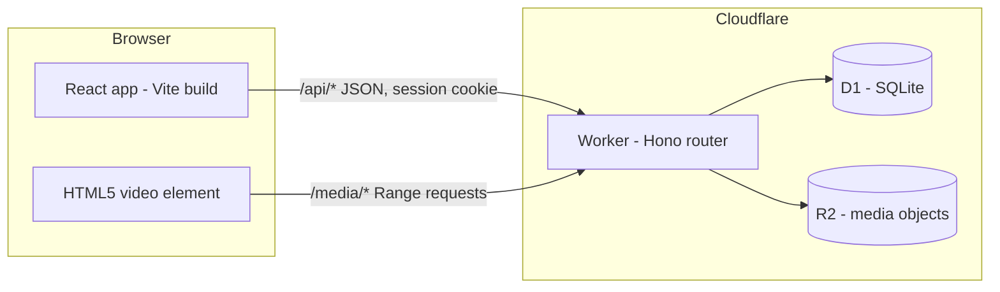
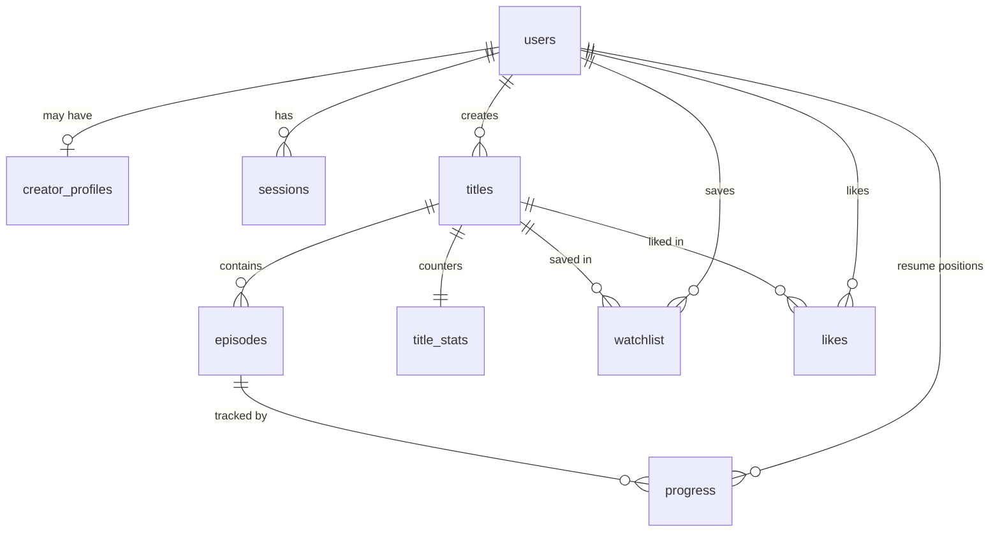

# Sweam architecture

## System overview

One Worker serves two very different kinds of traffic:

- `/api/*`: JSON routes. A session middleware resolves the cookie into a user once per request. Everything is validated with zod before it reaches a SQL statement, and every statement is parameterized.
- `/media/*`: byte-range media serving from R2. Deliberately outside the session middleware so segment requests never pay for a database read.

In development, `vite dev` proxies both prefixes to `wrangler dev`, so the app is same-origin in every environment and the codebase contains no CORS configuration at all.

## Data model

The scout portal (v0.3) adds four tables around this core: `scout_profiles`
(application-gated scout identities), `title_stats_daily` (per-day counter
deltas), `onesheet_views` (every scout look, logged), and `scout_interests`
(the contact loop). It also adds `titles.scoutable` (creator opt-in) and
`progress.max_position_s` (furthest position ever reached, which feeds
retention curves).

Key decisions:

- **Films are single-episode titles.** Every title owns episodes; a film is a title whose only episode is the feature. One watch pipeline, one resume system, one progress model for everything.
- **`title_stats` is denormalized on purpose.** The ranking needs impressions/plays/completes/likes per title on every Discover request. Maintaining counters transactionally alongside the event writes turns ranking into one indexed join instead of aggregation over event tables. The write paths are idempotent (plays increment only on a viewer's first beacon per episode; completes only on the 0-to-1 transition; likes only when a row is actually inserted or deleted).
- **Sessions store `sha256(token)`, never the token.** A leaked database cannot be replayed as live sessions. Cookies are HttpOnly, SameSite=Lax, Secure in production.
- **Timestamps are ISO-8601 UTC strings written by the application**, so they compare correctly as strings in SQLite and in TypeScript with no timezone folklore.

## Request flows

### Watch progress

1. The player beacons `POST /api/watch/:episodeId/progress` at most every 10 seconds while playing, on pause, on end, and on page hide (via `navigator.sendBeacon`).
2. The API upserts the resume position and the furthest position ever reached (`max_position_s`), marks the episode completed when the furthest position crosses 90% of duration, and maintains both `title_stats` and today's `title_stats_daily` row in the same D1 batch. Completion and retention read the furthest position, so seeking backward after finishing does not un-complete an episode or shrink the curve.
3. Completed episodes restart from zero on the next visit instead of resuming into the credits.

### Discovery ranking

`GET /api/discover` loads all published titles with their stats, scores them with the pure function in [`apps/api/src/lib/ranking.ts`](../apps/api/src/lib/ranking.ts), returns the top 30 with per-title reasons, and then increments each returned title's impression counter. That impression write is what makes the exploration bonus self-limiting: being surfaced consumes the bonus.

The score is a weighted sum of three components in [0, 1]:

- `quality = clamp01(0.75 * finishRate + 0.25 * likeRate)`, where `finishRate = (completes + 2.8) / (plays + 8)` (a Beta-style prior of 8 phantom plays at 35% completion, so tiny samples cannot spike) and `likeRate = 4 * likes / (plays + 8)`.
- `exploration = clamp01( sqrt( ln(catalogImpressions + e) / (8 * (impressions + 1)) ) )`, the UCB1 shape: it grows with total catalog activity and shrinks with the title's own exposure, so dormant titles resurface as the platform gets busier.
- `freshness = 0.5 ^ (ageDays / 10)`.

Weights are 0.55 / 0.30 / 0.15. The dominant component becomes the viewer-facing reason string. The fairness claims are unit tests, not marketing: see `apps/api/test/ranking.test.ts`.

### Media serving

`GET /media/:key` implements RFC 9110 single-range semantics over R2:

- No `Range` header: 200 with `Content-Length` and `Accept-Ranges: bytes`.
- `bytes=a-b`, `bytes=a-`, `bytes=-n`: 206 with exact `Content-Range` bookkeeping, reading only the requested window from R2.
- Unsatisfiable or multi-range requests: 416 with `Content-Range: bytes */size`.

The parser lives in [`apps/api/src/lib/range.ts`](../apps/api/src/lib/range.ts) with tests for the inclusive-end, clamping, suffix, and pathological cases. This is the mechanism that makes seeking, resume, and partial buffering work in the `<video>` element.

### Uploads

`PUT /api/studio/upload/:filename` streams the request body straight into R2 (the Worker never buffers the file), gated by an allowlist of content types (MP4, WebM, WebVTT, JPEG, PNG, WebP), a Content-Length requirement, and a 512 MB cap. The returned `/media/...` URL is what episode records store.

### Scout portal

Access is three-layered: any signed-in user can apply (`scout_profiles` row with status `pending`); only `approved` scouts pass `requireScout`; and every scout query is additionally filtered to `published = 1 AND scoutable = 1`, so a creator who never opts in is invisible to scouts no matter what. Approval is an operations step until the admin console ships (the seed file documents the one-line SQL).

The boards are small, published math in [`apps/api/src/lib/momentum.ts`](../apps/api/src/lib/momentum.ts):

- **Fastest growing** compares plays in the last 7 days against the 7 days before, smoothed as `(recent + 2) / (prior + 2)` so launches are meaningful and tiny spikes are not, and orders by `sqrt(recent) * growth` so acceleration is weighted by volume.
- **Finish-rate leaders** reuse the discovery ranking's smoothed finish rate, with a 20-play floor.
- **Genre breakouts** surface the top breakout score per genre.

**Retention curves** are computed from `progress.max_position_s`: for each of 11 checkpoints across the runtime, the share of tracked viewers whose furthest position reached it. Point 0 is 1.0 by construction and the curve never increases ([`buildRetentionCurve`](../apps/api/src/lib/momentum.ts), tested in `apps/api/test/momentum.test.ts`). Aggregating raw progress rows on demand is fine at current scale; at scale this becomes a per-episode rollup maintained on the beacon path.

Three deliberate privacy decisions: scouts see exactly the numbers the creator sees (the one-sheet and the creator's analytics page share the same loaders in [`apps/api/src/lib/analytics.ts`](../apps/api/src/lib/analytics.ts)); opening a one-sheet writes an `onesheet_views` row the creator can read, so scouting is never silent; and expressing interest hands the creator the scout's organization, note, and contact email rather than exposing the creator's contact details to the scout.

## Security posture

- Passwords: PBKDF2-SHA256, 100k iterations, per-user salt, constant-time comparison, versioned storage format so the work factor can be raised without a migration.
- Sign-in performs a dummy PBKDF2 derivation when the email is unknown, so response timing does not reveal which emails exist; the error message is identical either way.
- All inputs validated with zod; all SQL parameterized; LIKE patterns escape user input.
- Ownership checks on every Studio route (title and episode loads are scoped to the signed-in creator; a miss is a 404, not a 403, to avoid confirming existence).
- Draft titles are invisible everywhere public and watchable only by their creator.
- Known gaps at v0.3, tracked in the roadmap: rate limiting, email verification, moderation/DMCA pipeline, anonymous plays are not counted in stats, and scout approval is a manual operations step pending the admin console.

## Why this stack

- **Cloudflare Workers + D1 + R2**: the entire platform, including video serving, runs on a free tier with no servers to keep warm; local development needs zero cloud resources (`wrangler dev` simulates both bindings on disk).
- **Hono**: a router with types thin enough to read in one sitting; middleware model makes the session/guard layering explicit.
- **React + Vite**: boring on purpose. The interesting engineering budget went to the ranking, the media path, and accessibility.
- **npm workspaces monorepo**: one shared types package imported as source by both bundlers; drift between API responses and client expectations is a compile error.
