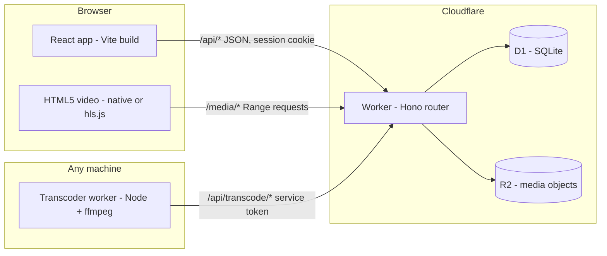
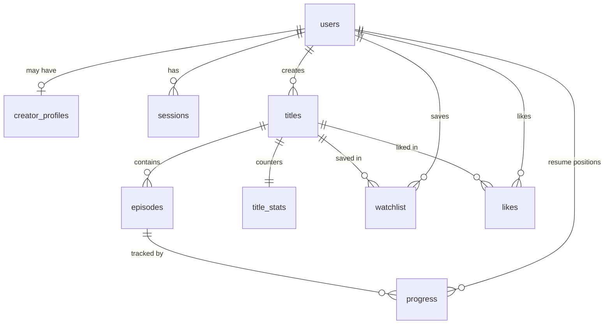

# Sweam architecture

## System overview

One Worker serves two very different kinds of traffic:

- `/api/*`: JSON routes. A session middleware resolves the cookie into a user once per request. Everything is validated with zod before it reaches a SQL statement, and every statement is parameterized.
- `/media/*`: byte-range media serving from R2. Deliberately outside the session middleware so segment requests never pay for a database read.

In development, `vite dev` proxies both prefixes to `wrangler dev`, so the app is same-origin in every environment and the codebase contains no CORS configuration at all.

## Data model

The scout portal (v0.3) adds four tables around this core: `scout_profiles`
(application-gated scout identities), `title_stats_daily` (per-day counter
deltas), `onesheet_views` (every scout look, logged), and `scout_interests`
(the contact loop). It also adds `titles.scoutable` (creator opt-in) and
`progress.max_position_s` (furthest position ever reached, which feeds
retention curves).

Key decisions:

- **Films are single-episode titles.** Every title owns episodes; a film is a title whose only episode is the feature. One watch pipeline, one resume system, one progress model for everything.
- **`title_stats` is denormalized on purpose.** The ranking needs impressions/plays/completes/likes per title on every Discover request. Maintaining counters transactionally alongside the event writes turns ranking into one indexed join instead of aggregation over event tables. The write paths are idempotent (plays increment only on a viewer's first beacon per episode; completes only on the 0-to-1 transition; likes only when a row is actually inserted or deleted).
- **Sessions store `sha256(token)`, never the token.** A leaked database cannot be replayed as live sessions. Cookies are HttpOnly, SameSite=Lax, Secure in production.
- **Timestamps are ISO-8601 UTC strings written by the application**, so they compare correctly as strings in SQLite and in TypeScript with no timezone folklore.

## Request flows

### Watch progress

1. The player beacons at most every 10 seconds while playing, on pause, on end, and on page hide (via `navigator.sendBeacon`). Signed-in viewers hit `POST /api/watch/:episodeId/progress`; signed-out viewers hit `POST /api/watch/:episodeId/view` with a random per-session UUID the client generates, never tied to an account, IP, or fingerprint, so anonymous plays count without collecting identity (resume stays an account feature).
2. The API upserts the resume position and the furthest position ever reached (`max_position_s`), marks the episode completed when the furthest position crosses 90% of duration, and maintains both `title_stats` and today's `title_stats_daily` row in the same D1 batch. Completion and retention read the furthest position, so seeking backward after finishing does not un-complete an episode or shrink the curve. Anonymous sessions maintain the same counters and feed the same retention curves.
3. Completed episodes restart from zero on the next visit instead of resuming into the credits.

### Discovery ranking

`GET /api/discover` loads all published titles with their stats, scores them with the pure function in [`apps/api/src/lib/ranking.ts`](../apps/api/src/lib/ranking.ts), returns the top 30 with per-title reasons, and then increments each returned title's impression counter. That impression write is what makes the exploration bonus self-limiting: being surfaced consumes the bonus.

The score is a weighted sum of three components in [0, 1]:

- `quality = clamp01(0.75 * finishRate + 0.25 * likeRate)`, where `finishRate = (completes + 2.8) / (plays + 8)` (a Beta-style prior of 8 phantom plays at 35% completion, so tiny samples cannot spike) and `likeRate = 4 * likes / (plays + 8)`.
- `exploration = clamp01( sqrt( ln(catalogImpressions + e) / (8 * (impressions + 1)) ) )`, the UCB1 shape: it grows with total catalog activity and shrinks with the title's own exposure, so dormant titles resurface as the platform gets busier.
- `freshness = 0.5 ^ (ageDays / 10)`.

Weights are 0.55 / 0.30 / 0.15. The dominant component becomes the viewer-facing reason string. The fairness claims are unit tests, not marketing: see `apps/api/test/ranking.test.ts`.

### Media serving

`GET /media/:key` implements RFC 9110 single-range semantics over R2:

- No `Range` header: 200 with `Content-Length` and `Accept-Ranges: bytes`.
- `bytes=a-b`, `bytes=a-`, `bytes=-n`: 206 with exact `Content-Range` bookkeeping, reading only the requested window from R2.
- Unsatisfiable or multi-range requests: 416 with `Content-Range: bytes */size`.

The parser lives in [`apps/api/src/lib/range.ts`](../apps/api/src/lib/range.ts) with tests for the inclusive-end, clamping, suffix, and pathological cases. This is the mechanism that makes seeking, resume, and partial buffering work in the `<video>` element.

### Uploads

`PUT /api/studio/upload/:filename` streams the request body straight into R2 (the Worker never buffers the file), gated by an allowlist of content types (MP4, WebM, WebVTT, JPEG, PNG, WebP), a Content-Length requirement, and a 512 MB cap. The returned `/media/...` URL is what episode records store.

Files over 32 MB go multipart: the client initializes an upload (8 MB parts), PUTs each part with up to three retries, and completes with the collected etags. Part state persists to localStorage keyed by the file's name, size, and modification time, so an interrupted upload of the same file resumes from the next part even after a page reload; server-side, R2's own multipart session is the durable state. A resume against a session the server no longer has aborts cleanly and restarts once.

### Media pipeline

ffmpeg cannot run inside a Worker, and a hosted transcoding product would break this repo's local-first promise. So the pipeline splits: the Worker is the **control plane** (job queue, output validation, the episode flip to HLS) and [apps/transcoder](../apps/transcoder) is the **data plane**, a Node worker that runs wherever ffmpeg exists: a laptop, a VPS, a container. They share one trust boundary, a bearer token on `/api/transcode/*` (the API refuses the dev default token in production).

Flow: a creator's uploaded `/media/` source is recorded as `episodes.source_url` and enqueued automatically on episode create or source change. A transcoder claims the job, probes the source (duration, height, audio), encodes a no-upscale HLS ladder in a single ffmpeg pass (split + scale per rendition, VOD playlists with independent segments, ffmpeg writing the master playlist), grabs a poster frame, uploads every output through the service API, and completes. The API verifies the master playlist actually exists in R2, then flips `episodes.video_url` to the master, sets the episode thumbnail and probed duration, and promotes the first thumbnail to the title poster if the creator has not set one.

Queue semantics, all enforced in SQL ([apps/api/src/routes/transcode.ts](../apps/api/src/routes/transcode.ts)):

- **At-least-once with atomic claims.** Claiming is a single UPDATE ... RETURNING on the oldest eligible job; parallel workers cannot double-claim.
- **Capped attempts.** Attempts increment on claim; after 3 the job is `failed` with the error surfaced in the creator's Studio next to a retry button.
- **Stale-claim reclaim.** A `running` job whose claim is older than 15 minutes is claimable again, so a dead worker cannot strand work.
- **Supersede protection.** Re-enqueueing cancels the episode's active job; a canceled job's `complete` gets a 409 and its outputs, written under its own `hls/{episode}/{job}/` prefix, can never collide with its replacement's.

Playlists reference variants and segments by bare relative names (ffmpeg runs inside the output directory), so the same files serve from any prefix. Playback: Safari plays HLS natively; other browsers lazy-load hls.js only when an `.m3u8` source needs it. External `https://` sources (like the demo catalog) bypass the pipeline entirely and play as-is.

### Scout portal

Access is three-layered: any signed-in user can apply (`scout_profiles` row with status `pending`); only `approved` scouts pass `requireScout`; and every scout query is additionally filtered to `published = 1 AND scoutable = 1`, so a creator who never opts in is invisible to scouts no matter what. Approval is an operations step until the admin console ships (the seed file documents the one-line SQL).

The boards are small, published math in [`apps/api/src/lib/momentum.ts`](../apps/api/src/lib/momentum.ts):

- **Fastest growing** compares plays in the last 7 days against the 7 days before, smoothed as `(recent + 2) / (prior + 2)` so launches are meaningful and tiny spikes are not, and orders by `sqrt(recent) * growth` so acceleration is weighted by volume.
- **Finish-rate leaders** reuse the discovery ranking's smoothed finish rate, with a 20-play floor.
- **Genre breakouts** surface the top breakout score per genre.

**Retention curves** are computed from `progress.max_position_s`: for each of 11 checkpoints across the runtime, the share of tracked viewers whose furthest position reached it. Point 0 is 1.0 by construction and the curve never increases ([`buildRetentionCurve`](../apps/api/src/lib/momentum.ts), tested in `apps/api/test/momentum.test.ts`). Aggregating raw progress rows on demand is fine at current scale; at scale this becomes a per-episode rollup maintained on the beacon path.

Three deliberate privacy decisions: scouts see exactly the numbers the creator sees (the one-sheet and the creator's analytics page share the same loaders in [`apps/api/src/lib/analytics.ts`](../apps/api/src/lib/analytics.ts)); opening a one-sheet writes an `onesheet_views` row the creator can read, so scouting is never silent; and expressing interest hands the creator the scout's organization, note, and contact email rather than exposing the creator's contact details to the scout.

### Trust, safety, and administration

Admins are rows in an `admins` table provisioned by operations; there is deliberately no self-serve path, and every `/api/admin/*` route sits behind that role. The console covers scout application decisions, the moderation queue, takedowns, strikes, transcode queue health with requeue, and maintenance.

The moderation model, end to end:

- **Reports** come from signed-in viewers, one per viewer per title, rate limited. They land in an admin queue that shows each report beside the creator's current strike count.
- **Resolutions** are dismiss, takedown, strike, or takedown-and-strike. A takedown (DMCA or community guidelines) unpublishes the title and blocks republishing until an admin releases it; a direct takedown path exists for notices that arrive outside the report flow. Strikes attach to the creator; **three active strikes in a rolling 90-day window suspend publishing, uploads, and new titles** (watching is never suspended), and strikes can be revoked.
- **Moderation is never silent**: every takedown, release, strike, and scout application decision writes an in-app notification to the affected person, and creators see their standing (strikes, takedowns) in the Studio.

**Rate limiting** is fixed-window counting on a D1 table: one upsert per request returns the window's count, and the first hit of each new window prunes that bucket's stale rows, so the table stays bounded with no scheduler. D1's single primary makes counts globally consistent. A fixed window admits up to 2x the budget across a boundary, which is acceptable for abuse control and stated here rather than hidden. Budgets live in [apps/api/src/lib/ratelimit.ts](../apps/api/src/lib/ratelimit.ts): per-email and per-address sign-in, per-address sign-up, and per-user reports, uploads, and scout applications, plus per-session anonymous beacons.

**Notifications** store prerendered text plus an optional app link, so the list is a plain indexed read and an entry stays accurate even if what it describes is later renamed or deleted. The nav badge is a count query refreshed on navigation; opening the page marks everything read.

### Monetization

The catalog is free to watch; revenue is AVOD pre-rolls, and the creator split (55%) is a published constant in [packages/shared/src/money.ts](../packages/shared/src/money.ts), not a private deal.

The ledger is integer millicents (1/1000 cent) end to end: a CPM priced in cents earns exactly `cpm_cents` millicents per impression, so sums never touch floating point and 1,000 impressions at a $12 CPM is exactly $12.00. Each served impression writes one row with its revenue and creator share **frozen at serve time**, so later CPM or split changes never rewrite history. The impression is recorded when ad playback actually starts, rate limited per viewer.

The pre-roll slot itself: nothing autoplays (the viewer starts the ad with a button press, which also satisfies browser audio policies), the ad is pausable, and it is skippable after five seconds. Frequency capping is one pre-roll per title per browser session, held client-side; the server-side pacing ledger is roadmap work.

Payouts: creators request their full available balance ($10.00 minimum, one open request at a time); admins mark requests paid or rejected, a rejection returning the amount to available, and either decision notifies the creator. Real money movement needs a payment provider and tax onboarding, so payout status is deliberately a ledger fact until that decision is made — the same local-first honesty rule as email.

### Community

Comments are title-scoped and flat with one level of replies (the API rejects deeper nesting). Removal is a soft-delete recording the remover's role, and the visibility rules are a pure, tested function ([apps/api/src/lib/comments.ts](../apps/api/src/lib/comments.ts)): visible comments render; a removed parent with visible replies stays as an empty-body placeholder so threads never orphan; removed bodies never appear in any payload. Three authorities share one removal endpoint: authors delete their own, the title's creator removes anything on their title, admins remove anything, and any removal not by the author notifies the author. Comment reports feed the same admin moderation page as title reports; removing a reported comment settles every open report against it at once. Comments are rate limited per user.

Follows power three things: public creator pages (`/c/:handle`, with follower counts), the "From creators you follow" rail on Home, and fan-out notifications, sent as a single INSERT...SELECT over the followers of a creator when they first publish a title or add an episode to a published one (republishing does not re-ping). At large follower counts that fan-out becomes a queued job; at current scale one statement is the honest implementation.

## Security posture

- Passwords: PBKDF2-SHA256, 100k iterations, per-user salt, constant-time comparison, versioned storage format so the work factor can be raised without a migration.
- Sign-in performs a dummy PBKDF2 derivation when the email is unknown, so response timing does not reveal which emails exist; the error message is identical either way.
- All inputs validated with zod; all SQL parameterized; LIKE patterns escape user input.
- Ownership checks on every Studio route (title and episode loads are scoped to the signed-in creator; a miss is a 404, not a 403, to avoid confirming existence).
- Draft titles are invisible everywhere public and watchable only by their creator.
- Known gaps, tracked in the roadmap: email verification and password reset (they need an email provider, which would break this repo's local-first promise, so the decision is explicit rather than half-shipped), comments and follows, and per-creator storage quotas.

## Why this stack

- **Cloudflare Workers + D1 + R2**: the entire platform, including video serving, runs on a free tier with no servers to keep warm; local development needs zero cloud resources (`wrangler dev` simulates both bindings on disk).
- **Hono**: a router with types thin enough to read in one sitting; middleware model makes the session/guard layering explicit.
- **React + Vite**: boring on purpose. The interesting engineering budget went to the ranking, the media path, and accessibility.
- **npm workspaces monorepo**: one shared types package imported as source by both bundlers; drift between API responses and client expectations is a compile error.
